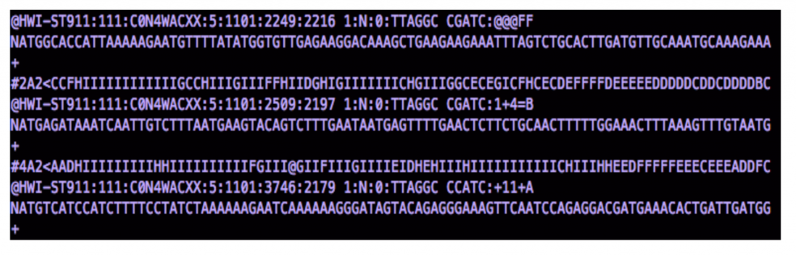
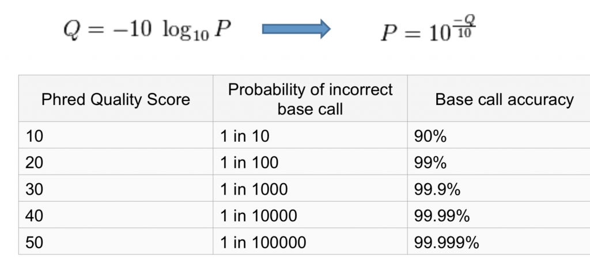
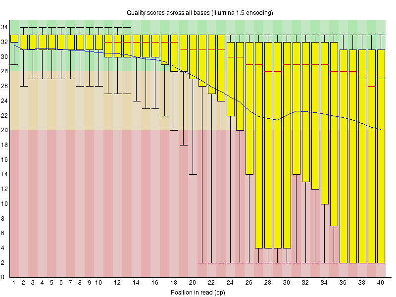
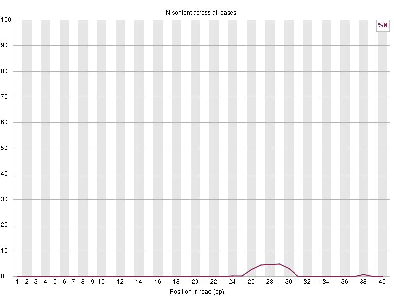
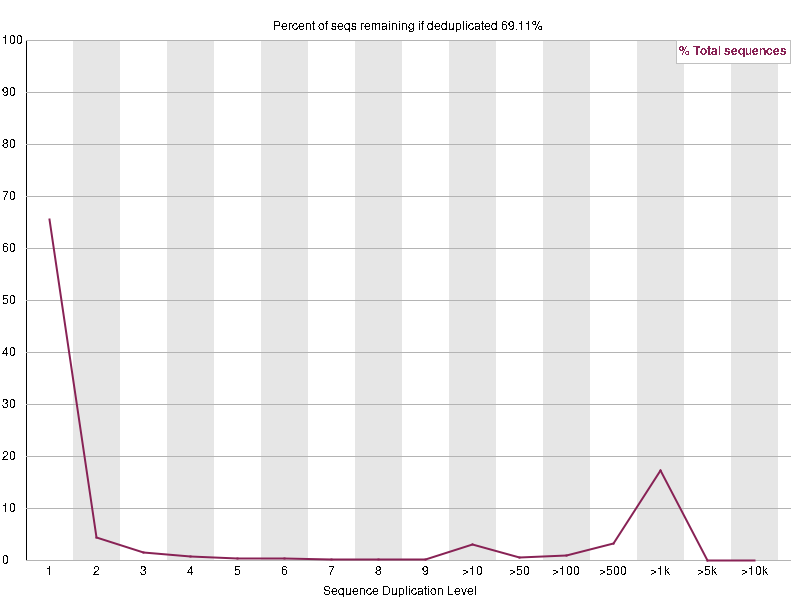
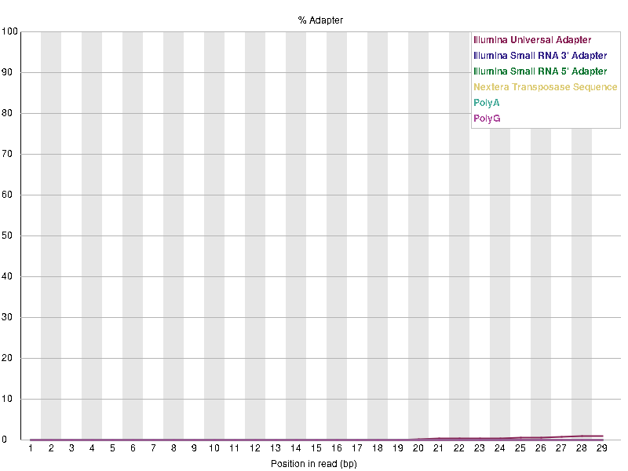
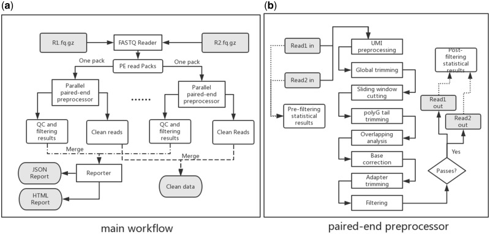
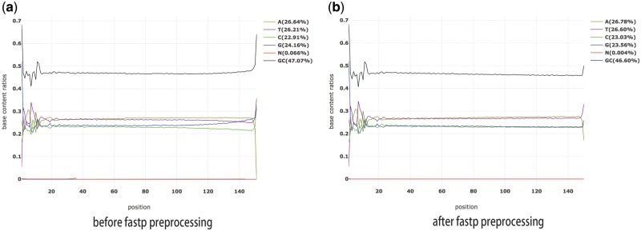
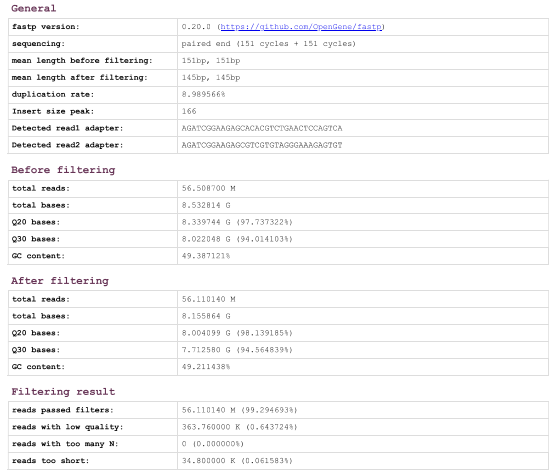

# Raw Data

## FASTQ file

FASTQ is a data file format that is used to store sequencing data and quality scores. It is used to contain raw data generated from NGS sequencing technologies. So the RNA-seqencing data is usually contained in a FASTQ file.

Here is a sample FASTQ file:

In the FASTQ file, each read is consist of four lines. 
* The first line is the sequence header which starts with an "@" (not a ">")!.
  * From the leading "@" to the first whitespace character is considered as the sequence identifier, which consist information about the cluster and sequence run (like flow cell lane, flow cell ID, run ID, instrument name).
  * Then the contents after the first whitespace are the sequence description.
* The second line is the sequence or the base-calls in standard letter code (A, C, G, T, N).
* The third line starts with a "+" and can have the same sequence identifier after, but usually just simply a "+" as a separator.
* The fourth line are the quality scores (Phred quality score for the sequence, encoded in ASCII characters).

## Phred Score
Phred Quality Score or the Q score is measures the base call accuracy. It report the probability that the given base is called incorrectly by the sequencer. Phred score is logarithmically related to the base calling probabilities (formula shown below). So if a base is assigned a Phred or Q score of 20, it equal to the probability of an incorrect base call of 1 on 100 times or a 99% base call accuracy.

## FASTQC Report
The FASTQC tool can be used to generate a quality check report of the FASTQ file based on the reads. A sample command would be `$ fastqc file1.fastq file2.fastq`.
After gaining a quality check report of the file, the graphs and contents in the report can indicate how good the data is.
For example, here is a graph that indicate bad **Phred score** across all reads.

If the yellow boxes that represent the Phred scores of the bases lands in the green area (scores greater than 28), it means they had good quality calls. If the boxes lands in the red area (scores less than 20), it means they had bad quality calls. Greater Phred scores represent better base calls.

Here is a graph that represent the **N content** in the sequence.

If a sequencer cannot make a base call with sufficient confidence, then it normally substitute the base read with a N.
So it raise a warning if any position in reads have an N content > 5%. And it give an error if the N content is > 20%.
Significant or large proportions of Ns usually indicate a general loss of quality, so it may indicate bad data.
In the example graph above, most of the positions have N content under 5%. And only in a few position the N content is about 5%, which will raise a warning.

Below is a graph that represent the **duplication level** across sequences.

In a properly diverse library, most sequences should fall into the far left of the plot, which indicate low duplication level. A high duplication level is more likely to indicate some kind of enrichment bias or presence of low complexity contaminants that may tend to produce spikes to the right side of the plot. In the plot above, mores sequences are in the far left. But there is a spike in the right side, which indicate high duplication level for some sequences.

The plot below shows the **adapter content** in the data.

The adapter content module will be shown if there is a significant portion of the insert sizes smaller than the length of the reads in the library. It indicate that the sequences' adapters need to be trimmed before proceeding any downstream analysis like read alignments.
The graph will indicate a warning if any sequence is present in > 5% of all reads. And it will indicate an error if the adapter content is > 10% of all reads.
In the plot shown above, no warning or error would be raised because there's no adapter content(%) that is greater than 5% across all positions in read. So it indicate good data.

After gaining a quality check report to see whether some features of the data indicate good or bad, further trimming and cleaning of the data can be done to clean the data and increase its quality.

# FASTP  

## FASTP Overview  
Fastp is a tool designed for preprocessing FASTQ files prior to downstream analysis. Its features include quality control, adapter trimming, quality filtering, per-read quality pruning and many other functions to provide clean data.  

## FAST Workflow  

### Main workflow:  
* Fastp parallelly process the input fastq files using multi-threading techniques to improve the efficiency.  
* It loads reads from FASTQ files and groups them into packs.  
* There is a one-on-one relationship between each pack of reads and the thread assigned to process it.  
  * Within each thread, each read from the pack is individually processed.
* Each thread operates independently to process its subset of reads and store reads’ statistical information in its own environment for later use.
  * This information may include per-cycle quality profiles, per-cycle base contents, results from adapter trimming and k-mer counts.
* After all the reads have been processed, these statistical information will be merged together.
* Fastp’s reporter will generate reports in both HTML (visualization) and JSON formats.
  * Reports provide both pre-filtering and post-filtering statistical information for comparison purposes.  

### Paired-end processing workflow：
*	UMI(Unique Molecular Identifiers) preprocessing: Process data containing UMIs by making the UMI to be the read’s identifier.  
*	Global trimming: trim all reads in the front or the tail.  
*	Sliding window cutting: As the window slide from either 5′end to 3′end or from 3′end to 5′, fastp evaluate the mean quality score within the window and drop the low-quality bases in each read’s head and tail.  
*	PolyG tail trimming: polyG tail is an issue for Illumina NextSeq or NovaSeq when T or C is misidentified as G by sequencers. By determine the data sequencers using flow cell identifier, fastp automatically removes polyG tail.  
*	Based correction: If fastp detects substantial overlap between one pair of reads, then it compares the bases within the overlapped region and performs a correction when the total number of mismatches is under a specified threshold.  
*	Adapter trimming: fastq automatically cut adapters for both single-end and paired-end Illumina data.  
    * For SE: fastq check the ends of the reads and identifying sequences that occur frequently across many reads as adapters.  
    * For PE: finding the overlap between each pair of reads enables the detection of adapter sequences.  
*	Filtering: reads with low quality, high proportions of N contents, or length under certain thresholds will be removed.

 ## Result
 
As the figure demonstrates, the curve for base G is abnormal before processing and the quantity of G does not match that of cytosine (C) which violates Chargaff's rule. After fastp processing, the curve for G gets normalized and the proportions of G and C matches.  
   
 The figure demonstrates the pre-filtering and post-filtering statistical values for a sample data. 363.76K reads with low quality is removed as well as 34.8K reads that are too short.

